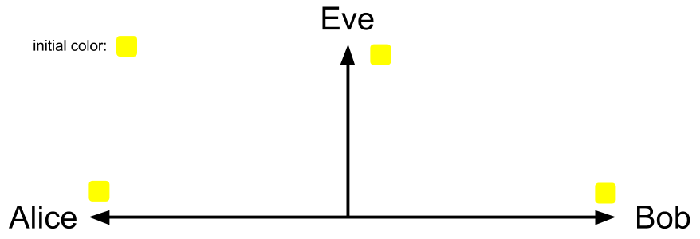
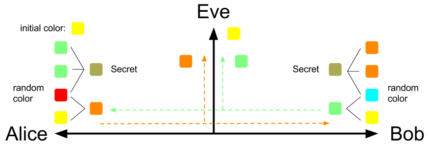
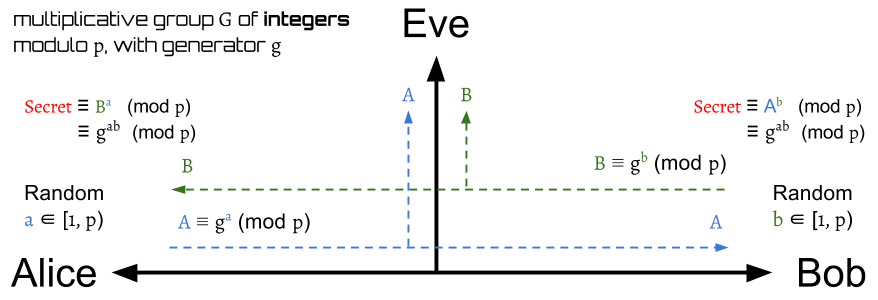
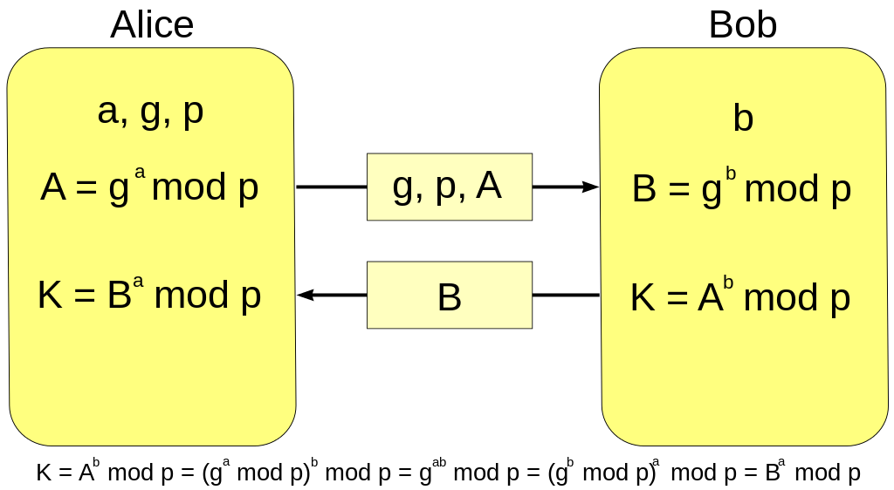
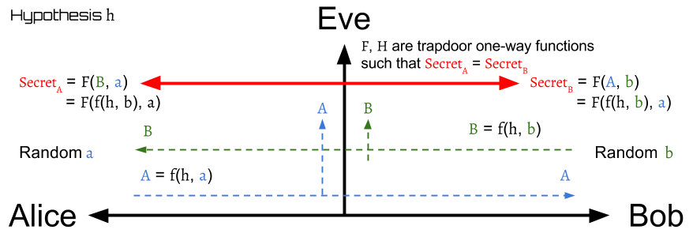
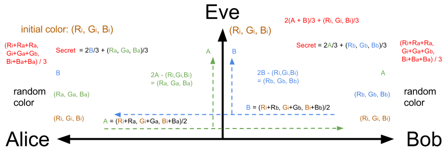
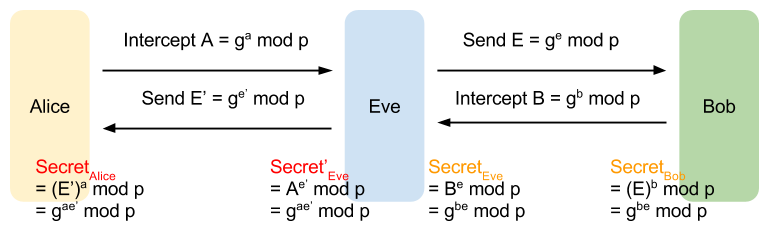

# Diffie-Hellman Key Exchange

Make two parties share secret messages.

## Problem

How do you shared secret messages with someone who don't have a shared key?
If they have the secret shared key, then they can use key crypto to
encrypt/decrypt messages.
Is it possible to build a secret shared key between two parties
if they already have a insecure channel?

### Alice, Bob, and Eve

Assume that there are Alice, Bob, and Eve.
Alice and Bob want to talk to each other privately,
but Eve can eavesdrop this channel.
The problem is: Can Alice and Bob build a secure channel between them?

#### Passive Attacker: Eve, a eavesdropper

Eve can see all messages on the channel,
but she can't modify them.

## Concept: Diffie-Hellman in colors

It's better to use the color-mixing to explain the _Diffie-Hellman_.
At first, Alice and Bob agree to use a color _Yellow_
as their initial color. This is not secret,
so Eve can also know they will use yellow as
their initial color.

Next, Alice and Bob will randomly choose a secret color
that won't tell anyone as their __private key__.
Suppose Alice and Bob choose _Red_ and _Cyan_ respectively,
then they will use their own secret color to mix with
the initial color _Yellow_.
After mixing the secret color with the initial color,
Alice will get color _Dark-Orange_,
and Bob will get color _Light-Green_ as their __public key__.

Next, Alice and Bob will give each other their mixing color.
Eve can eavesdrop the conversation between Alice and Bob,
so she can know their mixing color too.

After Alice receives Bob's mixing color: _Light-Green_,
she can make two copies of it and mixing these two with her
own secret color: _Red_ to get a final mixing color.

Similarly, Bob can produce a final color by mixing his
own secret color with the two copies of received mixing color from Alice.

Surprisingly, Alice and Bob will generate the __exactly same__ final color
by the above step! They will both get _Olive Green_!
The final color is the __shared secret key__ between the Alice and Bob.

After they both generate the same __shared secret key__,
they can use it to encrypt or decrypt their messages.

### Summary

At first, Alice and Bob choose their own secret color:
- Alice: Red
- Bob: Cyan

Then they mix their secret color with the initial color:

- Alice: Yellow + Red = Dark-Orange
- Bob: Yellow + Cyan = Light-Green

Next, they give each other their mixing color, and then
they both use the received mixing color
to produce the final color:

- Alice: Red + Light-Green + Light-Green = Olive Green
- Bob: Cyan + Dark-Orange + Dark-Orange = Olive Green

### Can we choose other colors?

This game works even Alice and Bob choose other secret colors.
Why not try your own to test and see the results?

#### Try you own

You can play this game on online color mixing tool, like [TryColors][TryColors].
If you want to re-produce our example, the used colors are:

| color       | code    |
| ----------- | ------- |
| Yellow      | #FFFF00 |
| Red         | #FF0000 |
| Cyan        | #00FFFF |
| Dark-Orange | #FF8000 |
| Light-Green | #80FF80 |
| Olive Green | #AAAA55 |

You can play our example online [here][ourExample].
We already put all colors on it.

For those who is curious about the information of the produced colors,
you can just enter the color code [here][htmlcsscolor] to get the color's name.

### Can Eve produce the final color?

Actually, Eve can produce the final color in this example
if Eve know how Alice and Bob will mix those colors.
However, if Alice and Bob finish their private conversation
by using the shared secret key to encrypt/decrypt messages
before Eve cracks the shared secret key, then the conversation
can still be safe.

In real world, the shared key is not easy to crack as our example here.
This will be well-explained after
introducing the standard _Diffie-Hellman_ below.

## Diffie-Hellman in Math

The initial setting between Alice and Bob from
the original implementation of the protocol is
a multiplicative group \\( G \\) of integers modulo \\( p \\) with generator \\( g \\),
where \\( p \\) is prime, and \\( g \\) is a primitive root modulo p.

The protocol is pretty simple.
First, both Alice and Bob agree to use one set of \\( g, p \\).
Then, just like the color example, Alice and Bob will respectively choose a
random integer \\( a, b \\), where \\( a, b \in [1, p-1] \\),as their __private key__.

Next, Alice and Bob will compute their __public key__ \\( A \\), \\( B \\):

\begin{aligned}
A = g^a \bmod p \\\\
\\\\
B = g^b \bmod p
\end{aligned}

and send them to each other.
That is, Alice will receive \\( B \\), and Bob will receive \\( A \\).

After exchanging the __public key__,
Alice and Bob can use the received number to produce a __shared secret key__.

Let the shared secret key of Alice and Bob are \\( Secret_A \\) and \\( Secret_B \\),
and they are defined by:

\begin{aligned}
Secret_A &= B^a \bmod p \\\\
         &= (g^b \bmod p)^a \bmod p \\\\
         &= g^{ab} \bmod p \\\\
\\\\
Secret_B &= A^b \bmod p \\\\
         &= (g^a \bmod p)^b \bmod p \\\\
         &= g^{ab} \bmod p
\end{aligned}

(For those who are not familiar with the above operations,
please read [modular arithmetic][mod_arith] in the appendix first.)

Thus,

$$
Secret_A = Secret_B
$$

Surprisingly, again, Alice and Bob will generate
the __exactly same__ shared secret key.
They can use this key to encrypt the sent messages
or decrypt the received messages.

Notice that \\( a, b, A, B, Secret_A, Secret_B \\) are all located in
range \\( [1, p-1] \\) because the operation \\( \bmod p \\).

### Examples

Let \\( G = \{ 1, 2, 3, 4 \} \\) with prime \\( p = 5 \\) and generator \\( g = 2 \\).
It's easy to check the group \\( G \\) by:

\begin{aligned}
2^1 \bmod 5 &= 2 \\\\
2^2 \bmod 5 &= 2 \cdot 2 \bmod 5 \\\\
            &= 4 \\\\
2^3 \bmod 5 &= 4 \cdot 2 \bmod 5 \\\\
            &= 3 \\\\
2^4 \bmod 5 &= 3 \cdot 2 \bmod 5 \\\\
            &= 1 \\\\
2^5 \bmod 5 &= 1 \cdot 2 \bmod 5 \\\\
            &= 2
\end{aligned}

The \\( g = 2 \\) indeed can generate all elements \\( \{ 1, 2, 3, 4 \} \\)
and the generated element will go back to the first at the \\( p \\) times.

After checking our settings, we start to play the _Diffie-Hellman_.
Suppose Alice picks \\( a = 3 \\) and Bob picks \\( b = 2 \\),
then

\begin{aligned}
A &= g^a \bmod p = 2^3 \bmod 5 = 3 \\\\
\\\\
B &= g^b \bmod p = 2^2 \bmod 5 = 4
\end{aligned}

Next, Alice will send \\( A \\) to Bob, and Bob will send \\( B \\) to Alice.
Then Alice and Bob can compute the shared secret key after receiving
the other's public key.

\begin{aligned}
Secret_A &= B^a \bmod p = 4^3 \bmod 5 = 4 \\\\
\\\\
Secret_B &= A^b \bmod p = 3^2 \bmod 5 = 4
\end{aligned}

It's obvious that \\( Secret_A = Secret_B \\) is a symmetric key pair,
so Alice and Bob can apply some symmetric key cryptography algorithm
such as _AES_, _DES_, to encrypt and decrypt their messages.

The following table shows what Alice, Bob, and Eve know about the numbers
for producing the shared secret key:

| Step | Alice                  | Eve          | Bob                    |
| ---- | ---------------------- | ------------ | ---------------------- |
| 0    | g = 2, p = 5           | g = 2, p = 5 | g = 2, p = 5           |
| 1    | a = 3                  |              | b = 2                  |
| 2    | A = 3                  | A = 3, B = 4 | B = 4                  |
| 3    | SecretA = 4 |              | SecretB = 4 |

To get familiar with the _Diffie-Hellman_ protocol,
you can use the [example groups in appendix][group_theory] to play it.

### One Round-Trip Implementation

The whole Diffie-Hellman can be actually done in one round-trip communication:

### Can Eve compute the shared secret key?

The answer depends on whether \\( G \\) and \\( g \\) are chosen properly.
In particular, the bigger of the size(or the order) of the group \\( G \\) is,
the better the security between Alice and Bob is.

When the size of \\( G \\) is small, like the above example,
it's easy to crack the _secret key_ from the _public key_.

For instance, Eve can list all power-value pairs upon she knows \\( g \\) and \\( p \\).
The power and value is actually the secret key and the public key.

| power(secret key) | value(public key) |
| ----------------- | ----------------- |
| 1                 | 2                 |
| 2                 | 4                 |
| 3                 | 3                 |
| 4                 | 1                 |

With the above table, she can easily get the correct secret keys
after receiving the public keys.
When Eve receives \\( A = 3, B = 4 \\),
she can look up the table to find the \\( a = 3, b = 2 \\).

However, if the size of group is very large,
then it will be very hard to list all the numbers
and search the matched secret keys.
This is actually the base of our network security today.
The function \\( f(x) = g^x \bmod p \\) is one of the __trapdoor__ functions,
or __one-way function__ functions.
It's easy to use \\( x \\) to compute \\( f(x) \\),
yet difficult to find its inverse function \\( f^{-1}(f(x)) \\) to get \\( x \\).
The inverse function here is called _discrete logarithm problem_.
It is considered to be computationally intractable.
Currently there is no efficient algorithm to compute
the discrete logarithms in general.

Thus, when \\( p \\) is a very large number(the size of \\( G \\) will be very large),
then Eve is currently impossible to eavesdrop the messages between Alice and Bob.

(See more of trapdoor function [here][trapdoor].)

### Generalization to Finite Cyclic Groups

_Diffie-Hellman_ protocol is actually can be generalize to finite cyclic groups,
instead of specifying with the multiplicative group of integers modulo \\( p \\).
In practice, _Elliptic Curve Diffie–Hellman_ protocol is usually a better choice.
It can achieve same security with less computation.

1. Alice and Bob agree to use a finite cyclic group \\( G \\) of order \\( n \\)
and a generator \\( g \\). The operation is defined: \\( g^2 = g \centerdot g \\),
where \\( \centerdot \\) is the operator of the group.
2. Alice randomly picks a number \\( a \\), \\( 1 \leq a < n \\),
and send \\( g^a \\) to Bob.
3. Similarly, Bob picks a random number \\( b \\), \\( 1 \leq b < n \\),
and send \\( g^b \\) to Alice.
4. Alice computes \\( (g^b)^a = g^{ab} \\)
4. Bob computes \\( (g^a)^b = g^{ab} \\)

The \\( f(x) = g^x \\) must be a one-way function and
there should be no efficient algorithm to compute \\( g^{ab} \\)
given \\( g^a \\) and \\( g^b \\), otherwise, the communication is insecure.

## General Model

From the above two examples of _Diffie-Hellman_,
we can find its general model.
The general model is shown on above figure.

To make sure the communication is secure,
function \\( f \\) must be one-way function
and there must be no efficient method to compute
the \\( Secret_A, Secret_B \\) given \\( A, B \\).

### The standard DH implementation

We demostrate the original implementation of _Diffie-Hellman_
in the general model below.

#### The Hypothesis and the Function Operation

Hypothesis \\( h \\) is the group geneator \\( g \\),
and the function \\( f, F \\) are defined:

$$
f(x,y) = F(x,y) = x^y \mod p
$$

#### Alice

Alice first randomly choose a secret number \\( a \\), \\( a \in [1, p) \\),
where \\( p \\) is the order of the group.
Next, Alice will compute a public key \\( A \\) and send it to Bob.
Then Alice will receive Bob's public key \\( B \\) and
then use it with secret number \\( a \\) to derive the shared key \\( Secret_A \\).
(For those who are not familiar with the following operations,
please read [modular arithmetic][mod_arith] in the appendix first.)

\begin{aligned}
       A =& f(h,a) \\\\
         =& f(g,a) = g^a \mod p \\\\
\\\\
Secret_A =& F(B,a) = B^a \mod p \\\\
         =& (f(h,b))^a \mod p \\\\
         =& (f(g,b))^a \mod p \\\\
         =& (g^b \mod p)^a \mod p \\\\
         =& g^{ab} \mod p
\end{aligned}

#### Bob

Similarly, Bob first randomly choose a secret number \\( b \\), \\( b \in [1, p) \\),
where \\( p \\) is the order of the group.
Next, Bob will compute a public key \\( B \\) and send it to Alice.
Then Bob will receive Alice's public key \\( A \\) and
then use it with secret number \\( b \\) to derive the shared key \\( Secret_B \\).

\begin{aligned}
       B =& f(h,b) \\\\
         =& f(g,b) = g^b \mod p \\\\
\\\\
Secret_B =& F(A,b) = A^b \mod p \\\\
         =& (f(h,a))^b \mod p \\\\
         =& (f(g,a))^b \mod p \\\\
         =& (g^a \mod p)^b \mod p \\\\
         =& g^{ab} \mod p
\end{aligned}

### For Color Calculation

#### Color Code

All of the color are mixed by red, green and blue lights.
They all can be coded in a RGB set \\( (r, g, b) \\),
where \\( r \\) is for red light, \\( g \\) is for green light, \\( b \\) is for blue light.

##### Operations

The operations of color code are defined:
1. \\( k(r, g, b) = (kr, kg, kb) \\), where \\( k \\) is a constant.
2. \\( (p, q, r) \square (l, m, n) = (p \square l, q \square m, r \square n) \\),
where \\( \square \\) can be any operator like \\( +, -, \cdot, / \\).

#### Color Mixing

Suppose we have n colors: \\( C_1, C_2, ...,C_n \\),
where \\( C_1 = (R_1, G_1, B_1), C_2 = (R_2, G_2, B_2), ...,
C_n = (R_n, G_n, B_n) \\).
The __mixing color__ for these n one is
\\( C_{mixing} = (C_1 + C_2 + ... + C_n)/n
= (\frac{R_1 + R_2 + ... + R_n}{n},
   \frac{G_1 + G_2 + ... + G_n}{n},
   \frac{B_1 + B_2 + ... + B_n}{n}) \\)

#### The Hypothesis and the Function Operation

Hypothesis \\( h \\) is the group geneator \\( g \\),
and the function \\( f, F \\) are defined:

\begin{aligned}
f(X,Y) =& \frac{X}{2} + \frac{Y}{2} \\\\
       =& \frac{(R_x, G_x, B_x)}{2} + \frac{(R_y, G_y, B_y)}{2} \\\\
       =& (\frac{R_x + R_y}{2},
           \frac{G_x + G_y}{2},
           \frac{B_x + B_y}{2}) \\\\
\\\\
F(X,Y) =& \frac{2X}{3} + \frac{Y}{3} \\\\
       =& \frac{(2R_x, 2G_x, 2B_x)}{3} + \frac{(R_y, G_y, B_y)}{3} \\\\
       =& (\frac{2R_x + R_y}{3},
           \frac{2G_x + G_y}{3},
           \frac{2B_x + B_y}{3})
\end{aligned}

$$
\text{, where } X = (R_x, G_x, B_x), Y=(R_y, G_y, B_y) \text{ are both RGB-color sets.}
$$

#### Alice

Randomly choose a secret color \\( a = (R_a, G_a, B_a) \\).

The mixing color \\( A \\), \\( A = (R_A, G_A, B_A) = f(h, a) \\), will be sent to Bob,
and Alice will receive a mixing color \\( B \\) from Bob.
Then \\( Secret_A \\) can be derived by \\( B \\) and \\( a \\).

\begin{aligned}
A =& (R_A, G_A, B_A) \\\\
  =& f(h, a) \\\\
  =& (\frac{R_i + R_a}{2},
      \frac{G_i + G_a}{2},
      \frac{B_i + B_a}{2})
\\\\
Secret_A =& F(B, a) \\\\
         =& (\frac{2R_B + R_a}{3},
             \frac{2G_B + G_a}{3},
             \frac{2B_B + B_a}{3}) \\\\
         =& (\frac{2(\frac{R_i + R_b}{2}) + R_a}{3},
             \frac{2(\frac{G_i + G_b}{2}) + G_a}{3},
             \frac{2(\frac{B_i + B_b}{2}) + B_a}{3}) \\\\
         =& (\frac{R_i + R_a + R_b}{3},
             \frac{G_i + G_a + G_b}{3},
             \frac{B_i + B_a + B_b}{3})
\end{aligned}

#### Bob

Randomly choose a secret color \\( b = (R_b, G_b, B_b) \\)

The mixing color \\( B \\), \\( B = (R_B, G_B, B_B) = f(h, b) \\), will be sent to Alice,
and Bob will receive a mixing color \\( A \\) from Alice.
Then \\( Secret_B \\) can be derived by \\( A \\) and \\( b \\).

\begin{aligned}
B =& (R_B, G_B, B_B) \\\\
  =& f(h, b) \\\\
  =& (\frac{R_i + R_b}{2},
      \frac{G_i + G_b}{2},
      \frac{B_i + B_b}{2})
\\\\
Secret_B =& F(A, b) \\\\
         =& (\frac{2R_A + R_b}{3},
             \frac{2G_A + G_b}{3},
             \frac{2B_A + B_b}{3}) \\\\
=& (\frac{2(\frac{R_i + R_a}{2}) + R_b}{3},
    \frac{2(\frac{G_i + G_a}{2}) + G_b}{3},
    \frac{2(\frac{B_i + B_a}{2}) + B_b}{3}) \\\\
=& (\frac{R_i + R_a + R_b}{3},
    \frac{G_i + G_a + G_b}{3},
    \frac{B_i + B_a + B_b}{3})
\end{aligned}

## Real World Usage

The symmetric secret key \\( Secret_A, Secret_B \\) is almost never used
as the cryptographic key directly since it may have some weak bits.
One possible solution is to use its __hash value__ instead
to overcome this weakness.

## Weak of DH: No Authentication

_Diffie-Hellman_ protocol has an obvious weak:
It has no __authentication__ mechanism.
__Neither side of the exchange is authenticated__.
Alice and Bob indeed can generate a shared secret key,
but Alice can't distinguish whether or not Bob is the real one,
and Bob can't know whether or not the one he is talking to is Alice.

This weak give Eve a chance to cheat them.
First, Eve can intercepts the public key \\( A \\) from Alice for Bob
and substitutes it with Eve's own public key \\( E \\) to Bob.
After Bob send back his public key \\( B \\), Eve will finally get a
shared secret key paired with Bob.

Next, Eve will act as Bob and send her another public key \\( E' \\) to Alice.
Then Eve can get a shared secret key paired with Alice.

That is, Eve can generate shared secret keys with them both

- SecretEve,
that is same as the one Bob has: SecretBob
- Secret'Eve,
that is same as the one Alice has: SecretAlice

Thus, Eve can build secure channels with them each other
and act as a bridge to pass the messages between Alice and Bob.
Alice still can talk to Bob through Eve, and vice versa.
However, Eve can know anything that Bob talks to Alice,
and all the Alice's messages to Bob
by decrypting the received messages from Alice or Bob.
Before re-encrypting with the appropriate key
and transmitting them to the other party,
Eve even can tamper the messages.

This is really dangerous.
Using __digital signatures__ is a possible solution
to avoid this active attack,
but it requires a public key infrastructure(PKI)
to do the authentication.

## One-way Function

The trapdoor function, or the one-way function,
is the base of the network security today.
Please read [trapdoor function][trapdoor]
in appendix to get more detail.

## Operation with More than Two Parties

The Diffie–Hellman protocol can work on more than two parties.
Please read [Diffie–Hellman in multiple parties][DH_mul]
in appendix to get more detail.

## References

- [General introduction of Diffie-Hellman Key Exchange][DH_KHAN]
- [Wiki: Diffie–Hellman key exchange][DH_wiki]
- [TryColors: Online Color Mixing tool][TryColors]
- [htmlcsscolor: Get Color Name and Info][htmlcsscolor]

[DH_KHAN]: https://www.youtube.com/watch?v=YEBfamv-_do "Public key cryptography - Diffie-Hellman Key Exchange"
[DH_wiki]: https://en.wikipedia.org/wiki/Diffie%E2%80%93Hellman_key_exchange "Diffie–Hellman key exchange"
[TryColors]: http://trycolors.com/ "Online Color Mixing tool"
[htmlcsscolor]: http://www.htmlcsscolor.com/ "Get Color Info"
[ourExample]: http://trycolors.com/?try=1&ffff00=0&ff0000=0&00ffff=0&ff8000=0&80ff80=0&aaaa55=0 "Our example"
[mod_arith]: ../modular_arithmetic.md "Modular Arithmetic"
[group_theory]: ../group_theory.md "Group Theory"
[trapdoor]: ../trapdoor_function.md "Trapdoor Function"
[DH_mul]: dh_multiple_parties.md "Diffie–Hellman with multiple parties"
