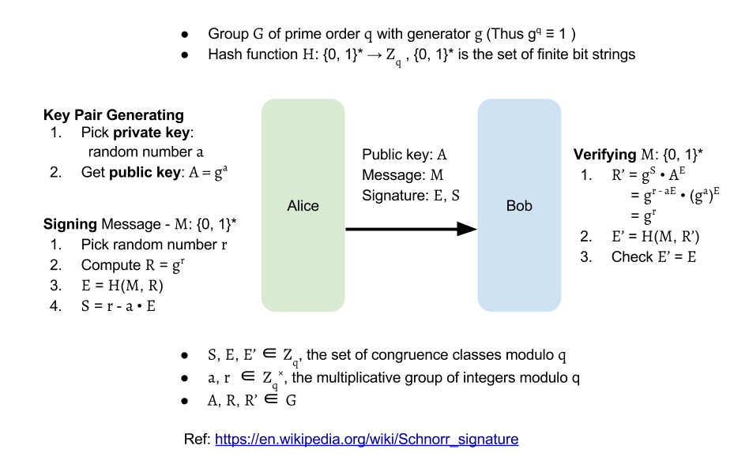
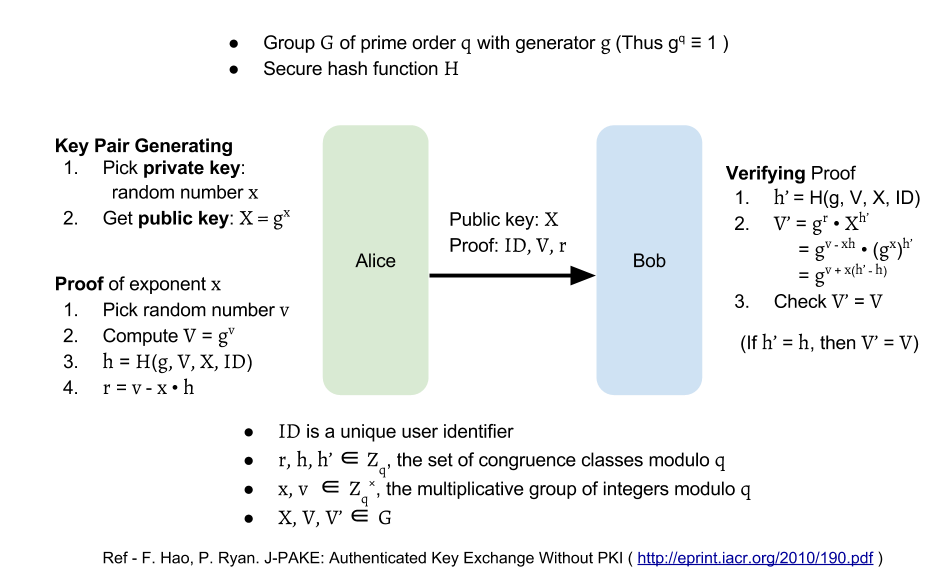

# Schnorr Signature

Schnorr Signature is one of [_Zero-Knowledge Proof_][zkp]

## Send messages with a Schnorr signature

## Proof of the exponent for X = gx

## References

- [Wiki: Schnorr signature][ss_wiki]
- [Youtube: Schnorr Digital Signature][ss_youtube]
- [JHU: More on Proofs of Knowledge][jhu_cs_640]

[zkp]: zkp.md "Zero-Knowledge Proof"
[ss_youtube]: https://www.youtube.com/watch?v=mV9hXEFUB6A "Youtube: Schnorr Digital Signature"
[ss_wiki]: https://en.wikipedia.org/wiki/Schnorr_signature "Wiki: Schnorr signature"
[jhu_cs_640]: http://www.cs.jhu.edu/~susan/600.641/scribes/lecture10.pdf "JHU: More on Proofs of Knowledge"
