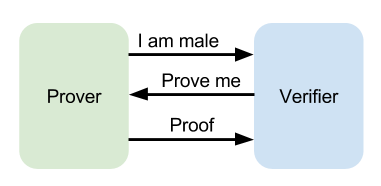
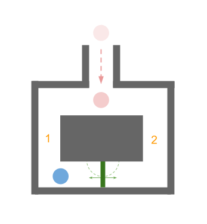
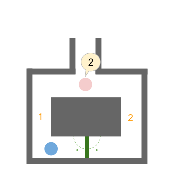
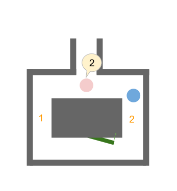

# Zero-Knowledge Proof

## Properties

- __completeness__:
if the proof is true, honest prover convince verifier
with overwhelming probability.
- __soundness__:
if the proof is false, no the honest verifier will be convinced
by the cheating prover, except with some negligible  probability.
- __zero knowledge__:
no secret leaked from proof.

## Abstract example

## References

- [Crypto Wiki: Zero-knowledge proofs][zkp_cryptowiki]
- [Wiki: Zero-knowledge proof][zkp_wiki]

[zkp_cryptowiki]: http://cryptowiki.net/index.php?title=Zero-knowledge_proofs "Crypto Wiki: Zero-knowledge proofs"
[zkp_wiki]: https://en.wikipedia.org/wiki/Zero-knowledge_proof "Wiki: Zero-knowledge proof"
