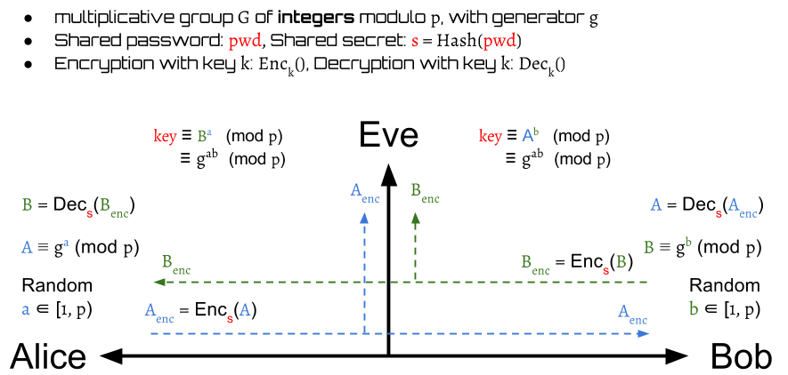
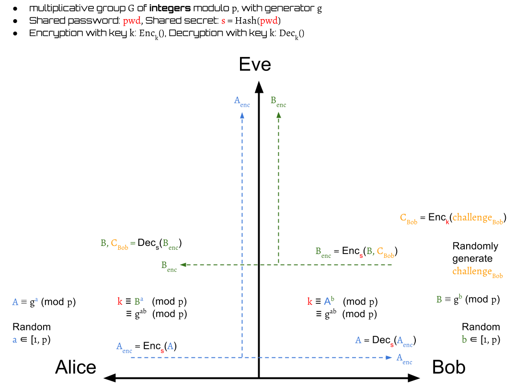
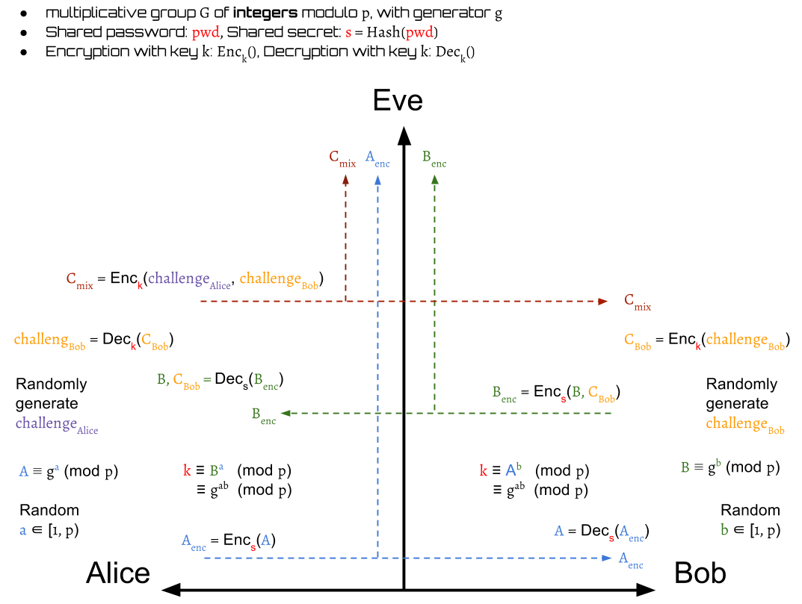
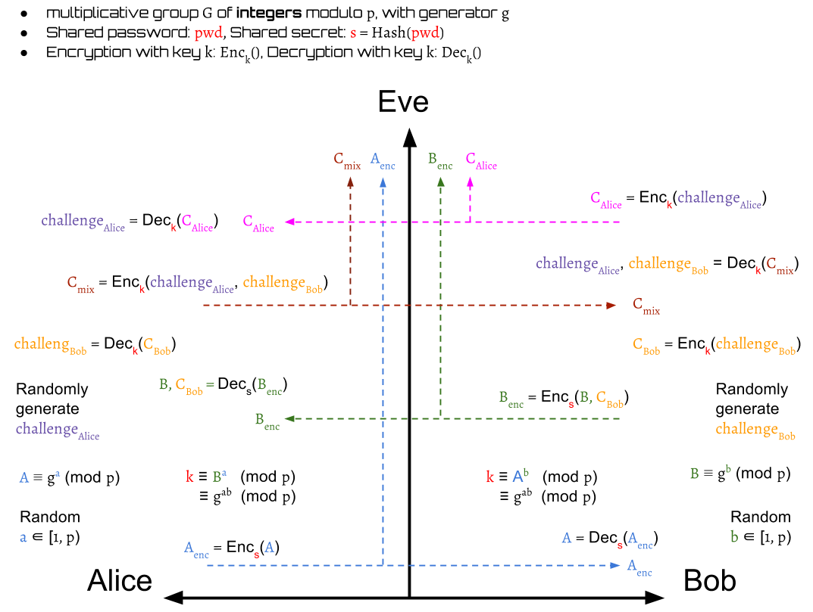

# Diffie-Hellman Encrypted Key Exchange

_Diffie-Hellman Encrypted Key Exchange_ is often abbreviated to _DH-EKE_.
It's one of the [original _EKE_ protocols][steven_Michael]
based on [_Diffie-Hellman Key Exchange_][dh].

## How It Work

Suppose we have two parties, Alice and Bob,
want to build a secure communication via
an established insecure channel.
Eve is a attackers who is enable to eavesdrop all the messages on the channel.

Assume that Alice and Bob possess the same password \\( pwd \\),
which is not leaked out and only they both know it.
Therefore, this password can be used as a key for authentication.
If we use this key to encrypt the data,
only the one who knows the key can decrypt it.
Some attackers without key are unable to pretend themselves as Alice or Bob.
Nevertheless, the password is usually a human-memorable weak password.
It will be easily cracked by performing an exhaustive search
if its bits is too short.
To make sure the shared key \\( s \\) is long enough,
we use the __hash value__ of the password as the key instead.
Thus, the shared secret key
$$
s = hash(pwd)
$$

### Basic Concept

The basic idea is to use the shared secret key \\( s \\) to
protect the public key swap of [_Diffie-Hellman Key Exchange_][dh].
Only the one who possess the key \\( s \\) can encrypt and decrypt the public keys.
They still can derive a symmetric session key \\( k \\) on both sides
for conversation.

### With Challenge–Response Authentication

In fact, the _DH-EKE_ is integrated by [_Diffie-Hellman_][dh] and
[challenge–response authentication][cra].
The _challenge_ is presented by one party,
and another party must reply a correct answer to be authenticated.

The first step of _DH-EKE_ is very similar to [_DH_][dh].
Alice picks a random number \\( a \in [1, p-1] \\) as her __private key__
and use it to generate a __public key__:
$$
A \equiv g^a \pmod p
$$

Then she sends the encrypted value of the public key:
$$
A_{enc} = Enc_s(A)
$$
to Bob. After receiving \\( A_{enc} \\), Bob gets Alice's public key \\( A\\)
by decrypting \\( A_{enc} \\):
$$
A = Dec_s(A_{enc})
$$

Then Bob picks a random number \\( b \in [1, p-1] \\) as his __private key__
to compute a __session key__:
$$
k \equiv A^b \equiv g^{ab} \pmod p
$$
for encryption in this communication.

Next, Bob generates his __public key__ \\( B \equiv g^b \pmod p \\)
and a random challenge \\( challenge_{Bob} \\).
The \\( challenge_{Bob} \\) is then encrypted by the session key \\( k \\)
into a value \\( C_{Bob} \\):
$$
C_{Bob} = Enc_k(challenge_{Bob})
$$

Then, Bob encrypts his public key \\( B \\) with \\( C_{Bob} \\)
into \\( B_{enc} \\) by \\( s \\) and sends it to Alice.
$$
B_{enc} = Enc_s(B, C_{Bob})
$$

Alice decrypts the received \\( B_{enc} \\)
to get Bob's public key \\( B \\) and \\( C_{Bob} \\).
$$
B, C_{Bob} = Dec_s(B_{enc})
$$

Then, Alice can compute a same __session key__ \\( k \\) as Bob
by her own private key,
$$
k \equiv B^a \equiv g^{ab} \pmod p
$$

After Alice has \\( k \\), she can use it to decrypt \\( C_{Bob} \\)
to get \\( challenge^{Alice}\_{Bob} \\).
The \\( challenge^{Alice}\_{Bob} \\) here represents that
Alice's decoded value of Bob's challenge:

$$
challenge^{Alice}\_{Bob} = Dec_k(C_{Bob})
$$

Next, Alice randomly generates her own challenge \\( challenge_{Alice} \\)
and then use it to encrypt with Bob's challenge \\( challenge_{Bob} \\)
into a value \\( C_{mix} \\) by the session key \\( k \\)

$$
C_{mix} = Enc_k(challenge_{Alice}, challenge^{Alice}\_{Bob})
$$

Then, Alice sends \\( C_{mix} \\) to Bob.

Later, Bob decrypts the \\( C_{mix} \\)
to output \\( challenge^{Bob}\_{Alice} \\) and \\( challenge^{Alice}\_{Bob} \\).
The \\( challenge^{Bob}\_{Alice} \\) here represents that
Bob's decoded value of Alice's challenge.
$$
challenge^{Bob}\_{Alice}, challenge^{Alice}\_{Bob} = Dec_k(C_{mix})
$$

In this step, Bob can authenticate Alice is valid or not
by checking her decoded value of his own challenge, \\( challenge^{Alice}\_{Bob} \\):

$$
valid(Alice) =
\begin{cases}
true,  & \text{if } challenge^{Alice}\_{Bob} = challenge_{Bob} \\\\
false, & \text{otherwise}
\end{cases}
$$

If Alice is invalid, then Bob drops the session.
Otherwise, Bob continue the protocols.

Next, Bob needs to prove his identification to Alice.
He encrypts \\( challenge^{Bob}\_{Alice} \\) into \\( C_{Alice} \\):
$$
C_{Alice} = Enc_k(challenge^{Bob}\_{Alice})
$$
and send it to Alice.

After receiving \\( C_{Alice} \\), Alice decrypts it to get Bob's decode value
of her own challenge:
$$
challenge^{Bob}\_{Alice} = Dec_k(C_{Alice})
$$

Alice now is also able to authenticate Bob:

$$
valid(Bob) =
\begin{cases}
true,  & \text{if } challenge^{Bob}\_{Alice} = challenge_{Alice} \\\\
false, & \text{otherwise}
\end{cases}
$$

Similarly, if Bob is invalid, then Alice drops the session.
Otherwise, the protocol finishes.

Finally, Alice and Bob authenticate mutually and they both
have a same session key \\( k \\) that can be used for encryption or decryption.

### Summary

1. Alice generates a private-public key pair and sends the encrypted public key to Bob
    1. Alice picks a random number \\( a \in [1, p-1] \\) as her private key
    2. Alice generates a public key \\( A \equiv g^a \pmod p \\)
    3. Alice encrypts her public key by shared secret key \\( s \\)
    4. Alice sends \\( A_{enc} = Enc_s(A) \\) to Bob.
2. Bob generates a private-public key pair and random challenge, computes the symmetric session key by his private key, and then sends the encrypted public key with the challenge to Alice
    1. Bob decrypts \\( A_{enc} \\) to get Alice's public key \\( A \\) by shared secret key \\( s \\)
    2. Bob picks a random number \\( b \in [1, p-1] \\) as his private key
    3. Bob computes a session key \\( k \equiv A^b \equiv g^{ab} \pmod p \\)
    4. Bob generates a public key \\( B \equiv g^b \pmod p \\)
    5. Bob randomly generates a \\( challenge_{Bob} \\)
    6. Bob encrypts \\( challenge_{Bob} \\) to \\( C_{Bob} \\) by \\( k \\)
    7. Bob sends \\( B_{enc} = Enc_s(B, C_{Bob}) \\) to Alice.
3. Alice get Bob's public key and challenge, computes the symmetric session key by her private key, then generates her random challenge and send Bob's challenge back with her own one for authentication
    1. Alice decrypts the received \\( B_{enc} \\) to get \\( B, C_{Bob} \\) by shared secret key \\( s \\)
    2. Alice computes a session key \\( k \equiv B^a \equiv g^{ab} \pmod p \\)
    3. Alice decrypts \\( C_{Bob} \\) to get Bob's challenge \\( challenge_{Bob} \\) by \\( k \\)
    4. Alice randomly generates a \\( challenge_{Alice} \\)
    5. Alice encrypts \\( challenge_{Alice}, challenge_{Bob} \\) to \\( C_{mix} \\) by \\( k \\)
    6. Alice sends \\( C_{mix} = Enc_k(challenge_{Alice}, challenge_{Bob}) \\) to Bob
4. Bob authenticates Alice by checking his own challenge with the received one
    1. Bob decrypts the received \\( C_{mix} \\) to get \\( challenge_{Alice}, challenge_{Bob} \\) by \\( k \\)
    2. Bob checks whether or not the received \\( challenge_{Bob} \\) is same as his original one
    3. Alice is authenticated if the answer is yes. Otherwise, drops session.
    4. Bob encrypts the received \\( challenge_{Alice} \\) to \\( C_{Alice} \\) by \\( k \\)
    5. Bob sends \\( C_{Alice} = Enc_k(challenge_{Alice}) \\)
5. Alice authenticates Bob by checking his own challenge with the received one
    1. Alice decrypts the received \\( C_{Alice} \\) to get \\( challenge_{Alice} \\) by \\( k \\)
    2. Alice checks whether or not received \\( challenge_{Alice} \\) is same as her original one
    3. Bob is authenticated if the answer is yes. Otherwise, drops session.

## Security Issues

### Short Exponents

The packets are transmitted byte-by-byte,
so its size of bits must be 8's multiple(1 byte = 8-bits).
Thus, if the modulo \\( p \\) is \\( n \\) bits, then the group must \\( n \\) bits.
The private key, the public key are all \\( n \\) bits.

Therefore, if \\( n \neq 8 \cdot k \\), where \\( k \in N \\),
then __some of bits are predictable__. They must be \\( 0 \\).
For example, if \\( p = 263 = 107_{16} = 0000000100000111_{2} \\),
then we know the range of the group is \\( [1, 262] \\) and the data is 2-bytes.
The first \\( 7 \\) bits in the first byte are all \\( 0 \\) because the elements in the group
are smaller than \\( 0000000100000111_{2} \\).

## References

- [Encrypted Key Exchange: Password-based Protocols Secure Against Dictionary Attacks][steven_Michael]

[steven_Michael]: https://www.cs.columbia.edu/~smb/papers/neke.pdf "Encrypted Key Exchange: Password-based Protocols Secure Against Dictionary Attacks"
[eke_stackoverflow]: http://stackoverflow.com/questions/15779392/encrypted-key-exchange-understanding "stackoverflow: Encrypted Key Exchange"
[dh]: ../../appendix/dh/dh.md "Diffie-Hellman Key Exchange"
[cra]: https://en.wikipedia.org/wiki/Challenge%E2%80%93response_authentication "Challenge–response authentication"
