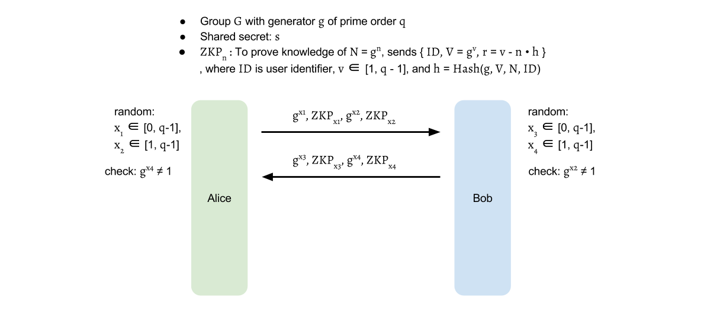
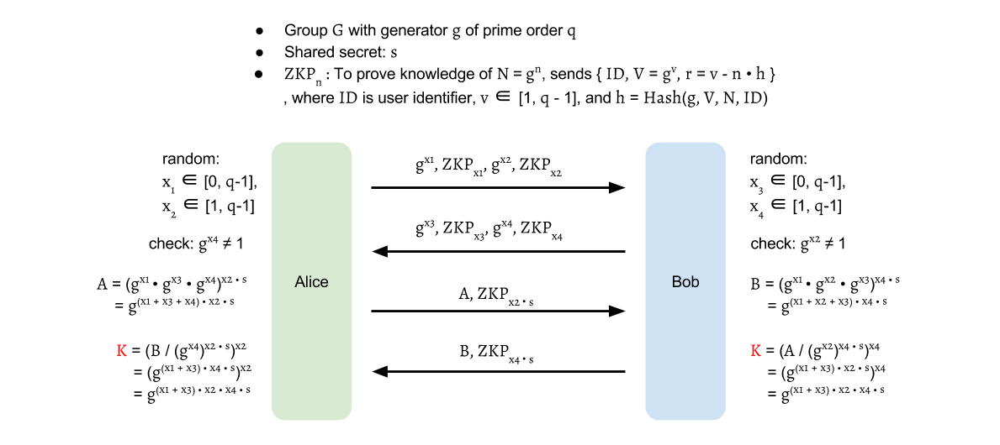
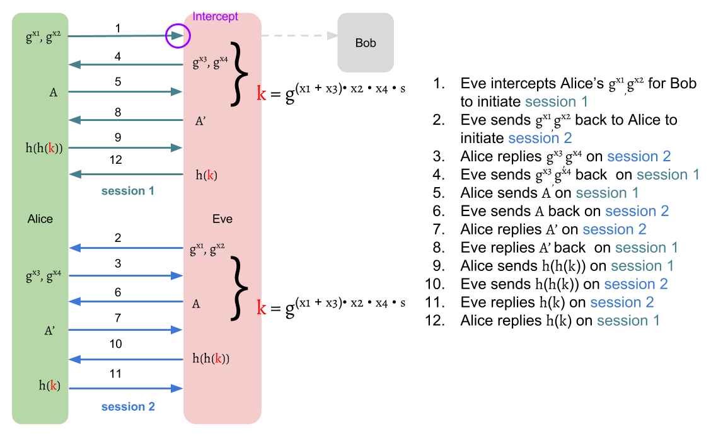

# J-PAKE Protocol

As a [_PAKE_][pake] family member,
_J-PAKE_ follows the [general two-stage framework][two-stages]:

1. __Key Establishment Protocol__:
Negotiate a one-time session key for the engaging parties.
2. __Key Confirmation Protocol__:
Authenticate each other has the same session key.

The key confirmation part is easy to understand.
It's nothing different from the introduction of [two-stage framework][two-stages].
In this chapter, we will focus on the first stage to realize
the magic behind _J-PAKE_.

Before introducing, let we define the symbols first:
Let group \\( G \\) is a subgroup of \\( Z^{\times}_p \\) with prime order \\( q \\),
in which the discrete log problem is intractable
(Nevertheless, \\( G \\) also can be switched to Elliptic curve cryptography group).
Let \\( g \\) is the generator of \\( G \\).
Typically, [Schnorr group][sg] is used in this protocol.

The two communication parties, Alice and Bob,
both agree on group \\( (G, g) \\).
Let \\( s \\) is their low-entropy shared secret,
which can be a password or hash of a password,
and \\( s \neq 0 \\) is not empty.
The value of \\( s \\) is assumed in \\( [1, q-1] \\).

## Key Establishment

The key establishment of _J-PAKE_ executes in two rounds.

### Round 1

In round 1, Alice selects \\( x_1 \in [0, q-1], x_2 \in [1, q-1] \\)
then sends out \\( g^{x_1}, g^{x_2} \\) with Zero-knowledge proof for \\( x_1, x_2 \\).
Similarly, Bob selects \\( x_3 \in [0, q-1], x_4 \in [1, q-1] \\) and
sends out \\( g^{x_3}, g^{x_4} \\) with Zero-knowledge proof for \\( x_3, x_4 \\).
The above communication can be completed in one round
as neither party depends on the other.
When it finishes, Alice and Bob verify the received Zero-knowledge proof
and also check \\( g^{x_2}, g^{x_4} \neq 1 \\).

### Round 2

Alice sends out \\( A = g^{(x_1 + x_3 + x_4) \cdot x_2 \cdot s} = (g^{x_1} \cdot g^{x_3} \cdot g^{x_4})^{x_2 \cdot s} \\)
and a Zero-knowledge proof for \\( x_2 \cdot s \\).
Similarly, Bob sends out \\( B = g^{(x_1 + x_2 + x_3) \cdot x_4 \cdot s} = (g^{x_1} \cdot g^{x_2} \cdot g^{x_3})^{x_4 \cdot s} \\)
and a Zero-knowledge proof for \\( x_4 \cdot s \\).

After round 2, Alice computes \\( K = (B / g^{x_2 \cdot x_4 \cdot s})^{x_2} = g^{(x_1 + x_3) \cdot x_2 \cdot x_4 \cdot s} \\),
and Bob computes \\( K = (A / g^{x_2 \cdot x_4 \cdot s})^{x_4} = g^{(x_1 + x_3) \cdot x_2 \cdot x_4 \cdot s} \\).

With the same keying material \\( K \\),
a session key can be derived for Alice and Bob: \\( k = H(K) \\),
where \\( H \\) is a [Cryptographic hash function][crypto_hash].

The division \\( / \\) here means multiplication with the __inverse element__.
For example, \\( a / b = a \cdot b^{-1} = b^{q - 1} \\), where \\( a, b \in G \\).
\\( b^{-1} \\) is an element such that \\( b \cdot b^{-1} = 1 \\),
known as the inverse element of \\( b \\).
From the fact that \\( b^q = 1 \\), where \\( q \\) is the order of \\( G \\),
\\( b^{q-i} \\) can be used as an inverse element of \\( b^i \\)
because \\( b^i \cdot b^{q-i} = b^q = 1 \\), where \\( i \in N \\).

Therefore, the \\( K \\) can be computed by

$$
\begin{aligned}
K &= (\frac{B}{g^{x_2 \cdot x_4 \cdot s}})^{x_2} \\\\
  &= (B \cdot g^{-(x_2 \cdot x_4 \cdot s}))^{x_2} \\\\
  &= (B \cdot (g^{x_2 \cdot x_4})^{-s})^{x_2} \\\\
  &= (B \cdot (g^{x_2 \cdot x_4})^{q-s})^{x_2} \\\\
\\\\
L &= g^{x_2 \cdot x_4} = (g^{x_4})^{x_2} \\\\
I &= L^{-s} = L^{q-s} \\\\
J_{Alice} &= B \cdot I \\\\
K &= (J_{Alice})^{x_2}
\end{aligned}
$$

$$
\text{ , where } q \text{ is the order of } G
$$

or

$$
\begin{aligned}
K &= (\frac{A}{g^{x_2 \cdot x_4 \cdot s}})^{x_4} \\\\
  &= (A \cdot g^{-(x_2 \cdot x_4 \cdot s)})^{x_4} \\\\
  &= (A \cdot (g^{x_2 \cdot x_4})^{-s})^{x_4} \\\\
  &= (A \cdot (g^{x_2 \cdot x_4})^{q-s})^{x_4} \\\\
\\\\
L &= g^{x_2 \cdot x_4} = (g^{x_2})^{x_4} \\\\
I &= L^{-s} = L^{q-s} \\\\
J_{Bob} &= A \cdot I \\\\
K &= (J_{Bob})^{x_4}
\end{aligned}
$$

$$
\text{ , where } q \text{ is the order of } G
$$

## Key Confirmation

There are several ways to achieve explicit key confirmation.
One simple method is to use [hash-key][two-stages]
like [_SPEKE_][speke] to do it:
Alice sends Bob \\( H(H(k)) \\), and then Bob replies with \\( H(k) \\).

Another method is use the session key \\( k \\) to
encrypt and decrypt a random value([random challenge][two-stages])
like [_EKE_][eke].

## Zero-Knowledge Proof

In the protocol, we need to produce a valid knowledge proof for the exponent.
As an example, we can use [Schnorr signature][ss] mentioned in appendix to do it.
To prove the knowledge of the exponent for \\( X = g^x \\),
one sends out \\( X \\) with Zero-Knowledge proof: \\( {ID, V = g^v, r = v - x \cdot h} \\),
where $ID$ is the unique user identifier,
\\( v \in Z_q \\) and \\( h = H(g, V, X, ID) \\), \\( H \\) is a secure hash function.
The receiver then can compute their own \\( h' = H(g, V, X, ID) \\)
and verifies \\( V = g^r \cdot X^{h'} \\).
The \\( ID \\) added here is to prevent Alice replaying Bob's signature back to Bob
and vise versa.

### Why does J-PAKE need Zero-Knowledge Proof

If we don't use _ZKP_ here,
_J-PAKE_ will suffer impersonation-attack like [_SPEKE_][speke]

### Can we use hash instead of ZKP

No. To use hash to verify, the two party must have the same secret.
If only one party has the secret, then the other has no way to verify it.
It doesn't has the value to hash, so it has no results to compare.

## Why x2, x4 and s can NOT be 0?

$$
K = g^{(x_1 + x_3) \cdot x_2 \cdot x_4 \cdot s}
$$

The attackers can intentionally choose \\( x_2 = 0 \\) or \\( x_4 = 0 \\)
to force the \\( K = 1 \\), even he doesn't know the password.
Therefore, the range of \\( x_2, x_4 \\) are specified in 1 to \\( q-1 \\).
This is also the same reason for \\( s \neq 0 \\).

### Why don't we just select x1, x2, x3, x4 between 1 to q-1?

The \\( K \\) still can be 1 if \\( x_1 + x_3 = 0 \\).
However, the probability is extremely low.
You can still select \\( x_1, x_2, x_3, x_4 \in [1, q-1] \\). It's valid.
But you will lose the combinations of
\\( x_1 = 0 \\) paired to \\( x_2, x_3, x_4 \neq 0 \\)
and \\( x_2 = 0 \\) paired to \\( x_1, x_3, x_4 \neq 0 \\).

## Examples

Let take the group in appendix for [Group Theory][group_theory] as an example.
\\( G = \{ 1, 2, 3, 4, 6, 8, 9, 12, 13, 16, 18 \} \\) is a [Schnorr group][sg]
with prime order \\( q = 11 \\) and generator \\( g = 9 \\),
which is the subgroup of \\( Z^{\times}_{23} = \{ x \vert 0 < x < 23 \cap x \in N \} \\).
\\( Z^{\times}_{23} \\) is a multiplicative group of integers modulo \\( p \\), \\( p = 23 \\).
And let shared secret \\( s = 7(1 \leq s \leq q-1) \\).

Suppose Alice first chooses \\( x_1 = 9(0 \leq x_1 \leq q-1), x_2 = 3(1 \leq x_2 \leq q-1) \\)
and Bob chooses \\( x_3 = 5(0 \leq x_3 \leq q-1), x_4 = 6(1 \leq x_4 \leq q-1) \\),
the final results are as follows:

| Rnd | Dir | Alice                         | Public                | Bob                          |
| --- | --- | ----------------------------- | --------------------- | ---------------------------- |
|     |     | g = 9, q = 11, p = 23, s = 7  | g = 9, q = 11, p = 23 | g = 9, q = 11, p = 23, s = 7 |
|     |     | x1 = 9, x2 = 3                |                       | x3 = 5, x4 = 6               |
| 1   | →   | gx1 = 2, gx2 = 16             | gx1 = 2, gx2 = 16     | gx1 = 2, gx2 = 16            |
| 1   | ←   | gx3 = 8, gx4 = 3              | gx3 = 8, gx4 = 3      | gx3 = 8, gx4 = 3             |
| 2   | →   | A = 12                        | A = 12                | A = 12                       |
| 2   | ←   | B = 18                        | B = 18                | B = 18                       |
|     |     | K = 11                |                       | K = 11                |

\\( g^{x_1}, g^{x_2}, g^{x_3}, g^{x_4} \\) can be directly get from
[example Schnorr group in appendix][group_theory].
Next, we will use \\( g^{x_1}, g^{x_2}, g^{x_3}, g^{x_4} \\)
to compute \\( A, B, K \\).
You can try all the following computation process
on [Online Big Number Calculator][bnc] to verify the results.

$$
\begin{aligned}
A &\equiv (g^{x_1} \cdot g^{x_3} \cdot g^{x_4})^{x_2 \cdot s} \pmod p\\\\
  &\equiv (2 \cdot 8 \cdot 3)^{3 \cdot 7} \pmod {23}\\\\
  &\equiv  (48)^{3 \cdot 7} \pmod {23}\\\\
  &\equiv  2^{3 \cdot 7} \pmod {23}\\\\
  &\equiv  (2^3)^7 \pmod {23}\\\\
  &\equiv  8^7 \pmod {23}\\\\
  &\equiv  12
\end{aligned}
$$

$$
\begin{aligned}
B &\equiv (g^{x_1} \cdot g^{x_2} \cdot g^{x_3})^{x_4 \cdot s} \pmod p\\\\
  &\equiv (2 \cdot 16 \cdot 8)^{6 \cdot 7} \pmod {23}\\\\
  &\equiv (256)^{6 \cdot 7} \pmod {23}\\\\
  &\equiv 3^{6 \cdot 7} \pmod {23}\\\\
  &\equiv (3^6)^7 \pmod {23}\\\\
  &\equiv 16^7 \pmod {23}\\\\
  &\equiv 18
\end{aligned}
$$

To compute \\( K \\) for Alice, we first start with \\( (g^{x_4})^{x_2} \\)
to get \\( g^{x_2 \cdot x_4} \\).
Next, we can use \\( (g^{x_2 \cdot x_4})^{-s} = (g^{x_2 \cdot x_4})^{q-s} \\)
to get \\( g^{-(x_2 \cdot x_4 \cdot s)} \\).
Then, \\( J_{Alice} = \frac{B}{g^{x_2 \cdot x_4 \cdot s}} \\) can be calculated
by \\( J_{Alice} = B \cdot g^{-(x_2 \cdot x_4 \cdot s)} = B \cdot (g^{x_2 \cdot x_4})^{-s} \\)
Finally, \\( K = (J_{Alice})^{x_2} \\).

$$
\begin{aligned}
L &\equiv (g^{x_4})^{x_2} \pmod p\\\\
  &\equiv 3^{3} \pmod {23}\\\\
  &\equiv 4 \\\\
\\\\
I &\equiv L^{-s} \equiv L^{q-s} \pmod p\\\\
  &\equiv 4^{11-7} \equiv 4^4 \pmod {23}\\\\
  &\equiv 3 \\\\
\\\\
J_{Alice} &\equiv B \cdot I \pmod p\\\\
          &\equiv 18 \cdot 3 \pmod {23}\\\\
          &\equiv 8 \\
\\\\
K &\equiv (J_{Alice})^{x_2} \pmod p\\\\
  &\equiv 8^{3} \pmod {23}\\\\
  &\equiv 6
\end{aligned}
$$

In the same way, Bob can start with \\( (g^{x_2})^{x_4} \\)
to get \\( g^{x_2 \cdot x_4} \\).
Then apply \\( (g^{x_2 \cdot x_4})^{-s} = (g^{x_2 \cdot x_4})^{q-s} \\)
to \\( K = (\frac{A}{g^{x_2 \cdot x_4 \cdot s}})^{x_4} = (A \cdot (g^{x_2 \cdot x_4})^{-s}))^{x_4} \\).

$$
\begin{aligned}
L &\equiv (g^{x_2})^{x_4} \pmod p\\\\
  &\equiv 16^{6} \pmod {23}\\\\
  &\equiv 4 \\\\
\\\\
I &\equiv L^{-s} \equiv L^{q-s} \pmod p\\\\
  &\equiv 4^{11-7} \equiv 4^4 \pmod {23}\\\\
  &\equiv 3 \\\\
\\\\
J_{Bob} &\equiv A \cdot I \pmod p\\\\
        &\equiv 12 \cdot 3 \pmod {23}\\\\
        &\equiv 13 \\\\
\\\\
K &\equiv (J_{Alice})^{x_4} \pmod p\\\\
  &\equiv 13^{6} \pmod {23}\\\\
  &\equiv 6
\end{aligned}
$$

## References

- [Password Authenticated Key Exchange by Juggling][jpake_wiki]
- [J-PAKE: Authenticated Key Exchange Without PKI][jpake_FHao_PRyan]
- [Online Big Number Calculator][bnc]

[sg]: https://en.wikipedia.org/wiki/Schnorr_group "Schnorr group"
[jpake_wiki]: https://en.wikipedia.org/wiki/Password_Authenticated_Key_Exchange_by_Juggling "Password Authenticated Key Exchange by Juggling"
[jpake_FHao_PRyan]: http://eprint.iacr.org/2010/190.pdf "J-PAKE: Authenticated Key Exchange Without PKI"
[crypto_hash]: https://en.wikipedia.org/wiki/Cryptographic_hash_function "Cryptographic hash function"
[pake]: ../../pake.md "Password Authenticated Key Exchange"
[two-stages]: ../../two_stages.md "General Two-Stage Framework"
[speke]: ../speke.md "SPEKE"
[eke]: ../dh-eke.md "DH-EKE"
[group_theory]: ../../../appendix/group_theory.md "Group Theory"
[ss]: ../../../appendix/zkp/schnorr_signature.md "Schnorr Signature"
[bnc]: https://defuse.ca/big-number-calculator.htm "Online Big Number Calculator"
