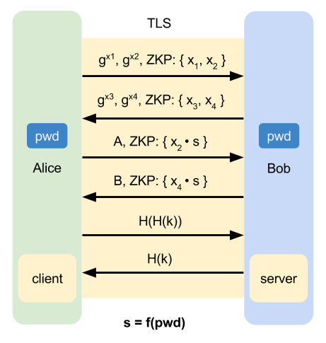
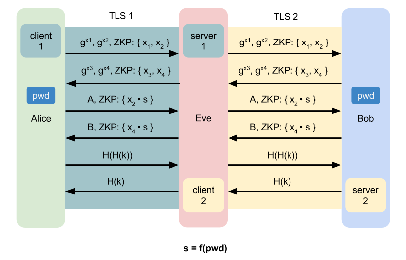
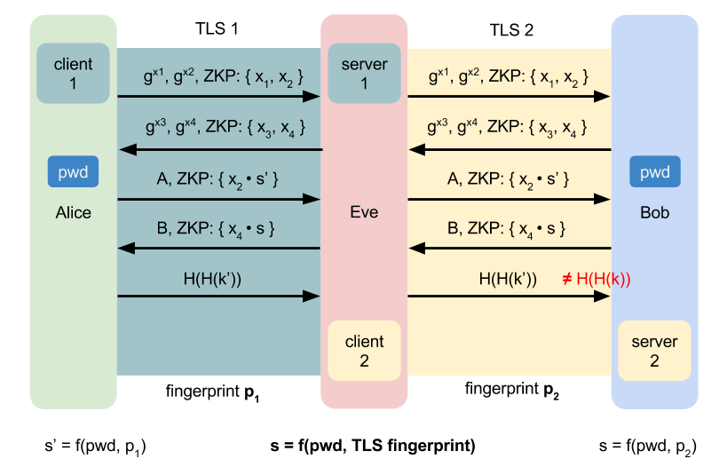

# J-PAKE over TLS

In the case that there is no trusted third party like _PKI_ in the network,
the certificate of server/client can not be authenticated.
That is, the communication parties can not verified each others,
while they can still establish a confidential channel without authentication.

However, if there is a shared password between the communication parties,
then we can use _PAKE_ to authenticate each side.
One approach is [Secure modular password authentication for the web using channel bindings][pake_tls]
published on [SSR 2014][ssr2014](We will use _SSR2014_ as this work later).

Here, we want to introduced a variant if _SSR2014_, named __J-PAKE over TLS__.
The basic concept is same as _SSR2014_, but we add a little change.

## Basic idea

Establish the confidential TLS channel without authentication first,
and then authenticate both side by _J-PAKE_.

## Man-in-the-middle

However, it can not prevent the man-in-the-middle(MITM) attack.

## Mixing TLS fingerprint in the shared secret

To avoid MITM, we can mix the TLS's fingerprint in

## References

- [Secure modular password authentication for the web using channel bindings][pake_tls]

[pake_tls]: https://s3.amazonaws.com/files.douglas.stebila.ca/files/research/papers/SSR-ManSteDen14.pdf "Secure modular password authentication for the web using channel bindings"
[ssr2014]: http://www.ssr2014.com/index.html "SSR 2014"
