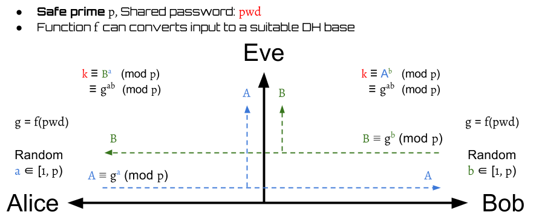
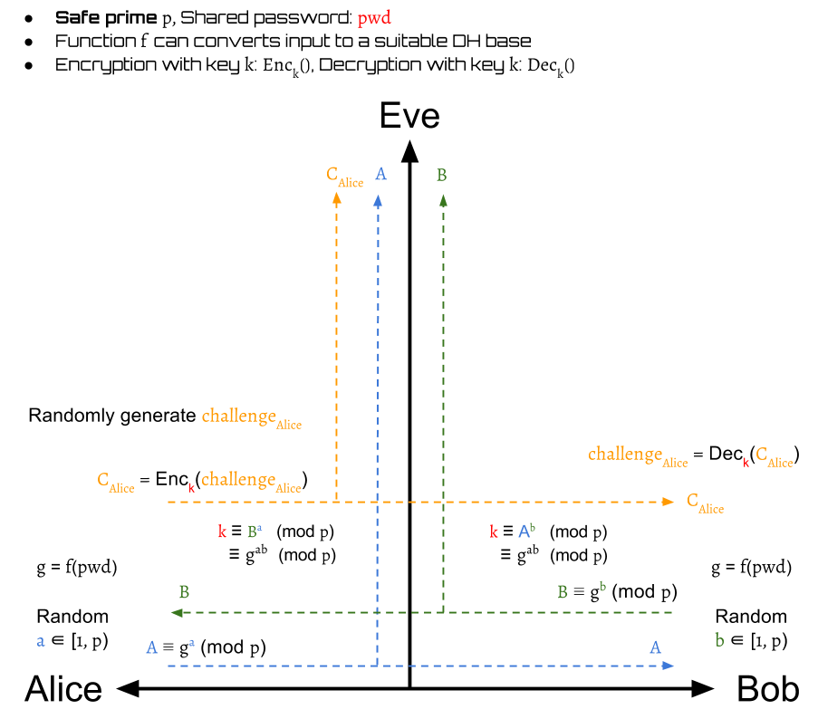
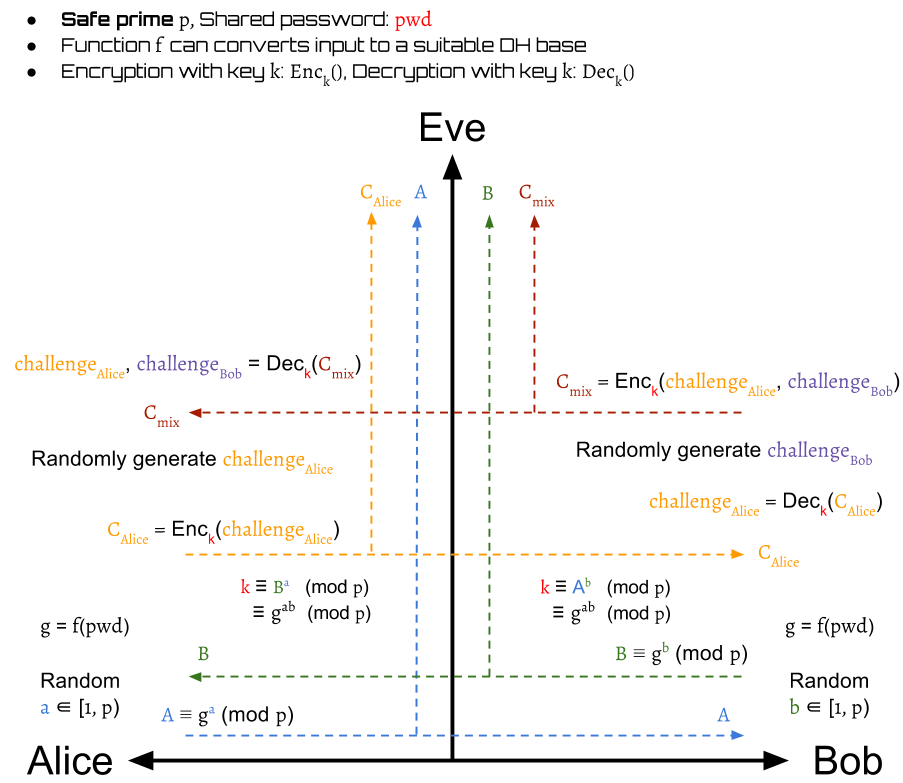
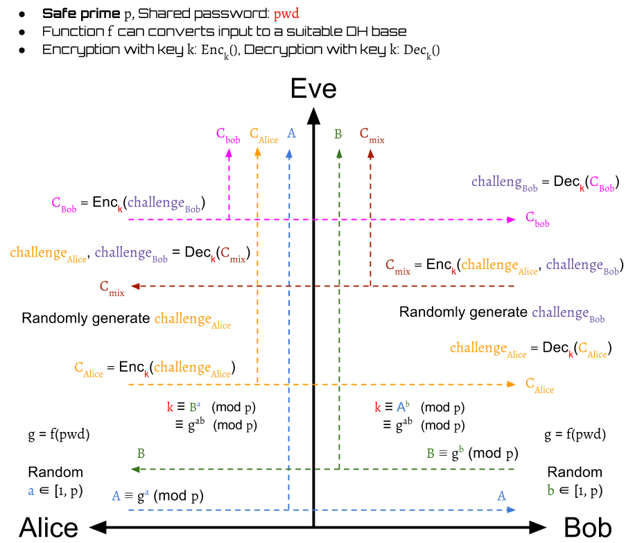
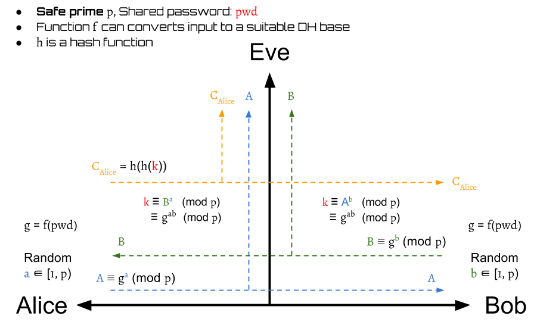
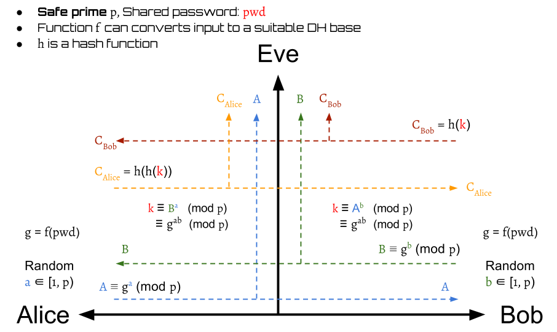
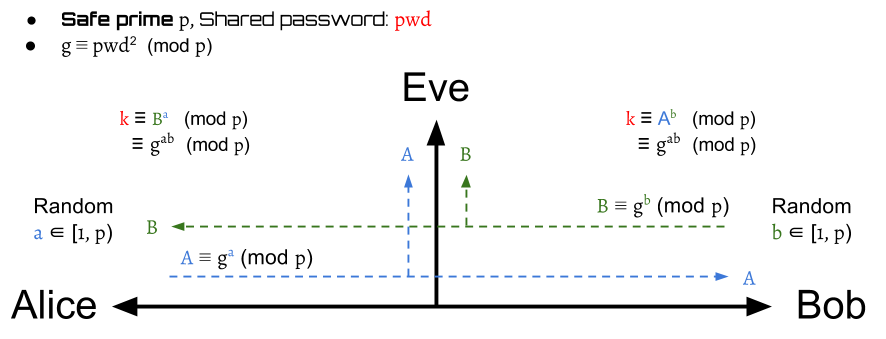
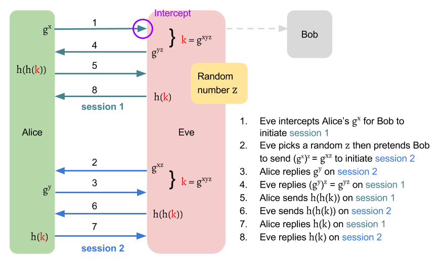
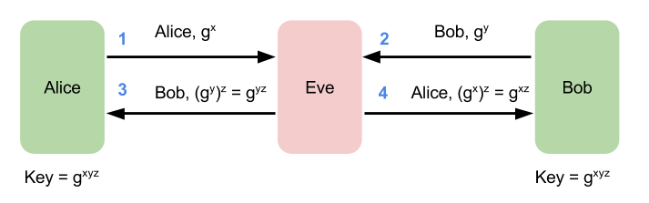

# Simple Password Exponential Key Exchange

_Simple Password Exponential Key Exchange_(SPEKE) is based on
[_Diffie-Hellman Key Exchange_(DH)][dh],
which is a balanced _PAKE_ protocol.
The difference of _SPEKE_ against _DH_ is that
its group generator is derived from the password
rather than a public assumption.
Only who knows the password can produce this private generator.

## How it work

The _SPEKE_ has two stages:

1. Session key establishment by [_DH_][dh]
2. Authentication

Although there are some variations of _SPEKE_,
their stage 1 is basically same.
It uses the [_DH_][dh] protocol to build a session key.

The stage 2 is to authenticate the conversation subject.
We will introduce two ways to authenticate in this content.

### Stage 1: Session Key Establishment

The stage 1 of _SPEKE_ is shown above.
Instead of using a public group generator directly,
_SPEKE_ has a function \\( f \\) that can produce generators by inputs.
Thus, we use the shared password \\( pwd \\) to create a generator
$$
g = f(pwd)
$$
and use it to complete the _DH_ protocol.

The modulo \\( p \\) used here is a [safe prime][sp]
\begin{aligned}
p = 2q + 1 \text{, where $q$ is also a prime}
\end{aligned}

After this stage finishes,
the Alice and Bob can get a symmetric session key \\( k \\)
to encrypt/decrypt the transmitted messages.

### Stage 2 with Challenge–Response Authentication

[Challenge–Response Authentication][cra] is one way
to verify whether or not the other party is Bob.
The detail can be seen in the following terms.

Alice generates a random challenge \\( challenge_{Alice} \\)
and then encrypt it to \\( C_{Alice} \\) by the session key \\( k \\):
$$
C_{Alice} = Enc_k(challenge_{Alice})
$$

Bob then can decrypt \\( C_{Alice} \\) to \\( challenge^{Bob}\_{Alice} \\)
by the session key \\( k \\):
$$
challenge^{Bob}\_{Alice} = Dec_k(C_{Alice})
$$

Then, Bob also generates a random challenge \\( challenge_{Bob} \\).
It is encrypted with \\( challenge^{Bob}\_{Alice} \\)
into \\( C_{mix} \\) by \\( k \\) and then send back to Alice:
$$
C_{mix} = Enc_k(challenge^{Bob}\_{Alice}, challenge_{Bob})
$$

After Alice receives \\( C_{mix} \\), she can decrypt it to get
$$
challenge^{Bob}\_{Alice}, challenge^{Alice}\_{Bob} = Dec_k(C_{mix})
$$

Alice now is able to verify whether or not Bob is valid by
comparing the received Bob's decrypted value of her challenge
and her original one.
$$
valid(Bob) =
\begin{cases}
true,  & \text{if } challenge^{Bob}\_{Alice} = challenge_{Alice} \\\\
false, & \text{otherwise}
\end{cases}
$$

If Bob is invalid, then Alice immediately drops the session.
Otherwise, the protocol should continue.

Beside the \\( challenge^{Bob}\_{Alice} \\),
Alice also get a decrypted value of Bob's challenge \\( challenge^{Alice}\_{Bob} \\).
This is used as a proof that Alice has the same key \\( k \\) as Bob.
Alice sends \\( C_{Bob} \\) to Bob for authentication:
$$
C_{Bob} = Enc_k(challenge^{Alice}\_{Bob})
$$

When Bob receives the \\( C_{Bob} \\), he can decrypt it:
$$
challenge^{Alice}\_{Bob} = Dec_k(C_{Bob})
$$
to compare Alice's decrypted value of his own challenge
with his original one.

$$
valid(Alice) =
\begin{cases}
true,  & \text{if } challenge^{Alice}\_{Bob} = challenge_{Bob} \\\\
false, & \text{otherwise}
\end{cases}
$$
If they are different, the Bob immediately drops the session.
Otherwise, Alice is authenticated and the protocol finishes.

### Stage 2 with Hash-Key Authentication

Instead of random challenge,
another simpler method to authenticate the other party
is to use hash function.
The steps consists of the following:

First, Alice send twice hashed value of the session key to Bob:
$$
C_{Alice} = h(h(k))
$$

Then Bob can authenticate Alice by
$$
valid(Alice) =
\begin{cases}
true,  & \text{if } C_{Alice} = h(h(k)) \\\\
false, & \text{otherwise}
\end{cases}
$$

If Alice is a invalid party, then the session is dropped.
Otherwise, the protocol continues.

After verifying Alice, Bob also need to prove his identification to Alice.
Bob sends
$$
C_{Bob} = h(k)
$$
to Alice. Alice then can certify Bob by
$$
valid(Bob) =
\begin{cases}
true,  & \text{if }h(C_{Bob}) = C_{Alice} \\\\
false, & \text{otherwise}
\end{cases}
$$

Finally, they can authenticate mutually.

### Summary

## Security Issues

### Short Exponents

Similar to the case of [_DH-EKE_][dh-eke], partial bits may be predictable.

### Test multiple passwords in one time

#### f(x) = x2 mod p

The basic idea to get the generator is to define \\( f(x) = x^2 \bmod p \\),
, where \\( p \\) is a safe prime such that \\( p = 2q + 1 \\), \\( q \\) is also a prime.
Then, the generator \\( g \\) will be computed by \\( pwd^2 \bmod p \\).
This makes sure that every \\( f(x) \\) will be a generator of
a cyclic subgroup of \\( G \\), where \\( G = \{ x \vert 0 < x < p \cap x \in N \} \\)
(__We need a proof here!__)

If we take \\( q = 11 \\) to get a safe prime \\( p = 23 \\), then the generators are:

| x  | f(x) |
| -- | ---- |
| 1  | 1    |
| 2  | 4    |
| 3  | 9    |
| 4  | 16   |
| 5  | 2    |
| 6  | 13   |
| 7  | 3    |
| 8  | 18   |
| 9  | 12   |
| 10 | 8    |
| 11 | 6    |
| 12 | 6    |
| 13 | 8    |
| 14 | 12   |
| 15 | 18   |
| 16 | 3    |
| 17 | 13   |
| 18 | 2    |
| 19 | 16   |
| 20 | 9    |
| 21 | 4    |
| 22 | 1    |
| 23 | 0    |
| 24 | 1    |
| 25 | 4    |
| .. | ..   |

From the table above, one obvious fact is that
the attacker is allowed to test two \\( pwd \\) by guessing one \\( g = f(pwd) \\).
For example, the attacker can guess the \\( g = 16 = f(pwd) \\).
If he doesn't hit, then he knows that \\( pwd \\) is not 4 and 19.
In the worst case that the \\( pwd \\) is fixed,
the attacker can use half time to force brute the \\( pwd \\).

The collision is __guaranteed__ because
\begin{aligned}
(q + k + 1)^2 \equiv (q - k)^2 \pmod p \\\\
\text{ ,where $k \in Z, p = 2q + 1$.}
\end{aligned}

__Proof__:
$$
\begin{aligned}
(q + k + 1)^2
&\equiv (q + (k + 1))^2 \\\\
& \equiv q^2 + 2q(k+1) + (k+1)^2 \pmod {2q + 1} \\\\
&\equiv q^2 + 2kq + 2q + k^2 + 2k + 1 \pmod {2q + 1} \\\\
&\equiv q^2 - 2kq + k^2 + 4kq + 2k + 2q + 1 \pmod {2q + 1} \\\\
&\equiv (q - k)^2 + 2k(2q + 1) + (2q + 1) \pmod {2q + 1} \\\\
&\equiv (q - k)^2 + (2k + 1)(2q + 1) \pmod {2q + 1} \\\\
&\equiv (q - k)^2 \pmod {2q + 1}
\end{aligned}
$$

When \\( k = 0 \\), then \\( (12)^2 \equiv (11)^2 \pmod {23} \\).
When \\( k = 1 \\), then \\( (13)^2 \equiv (10)^2 \pmod {23} \\).
...

#### f(x) = (hash(x))2 mod p

Suppose we have a hash table

| x  | hash(x) | f(x) |
| -- | ------- | -----|
| 1  | 17      | 13   |
| 2  | 9       | 12   |
| 3  | 20      | 9    |
| 4  | 1       | 1    |
| 5  | 15      | 18   |
| 6  | 10      | 8    |
| 7  | 2       | 4    |
| 8  | 5       | 2    |
| 9  | 22      | 1    |
| 10 | 23      | 0    |
| 11 | 7       | 3    |
| 12 | 19      | 16   |
| 13 | 4       | 16   |
| 14 | 6       | 13   |
| 15 | 3       | 9    |
| 16 | 11      | 6    |
| 17 | 8       | 18   |
| 18 | 14      | 12   |
| 19 | 21      | 4    |
| 20 | 12      | 6    |
| 21 | 18      | 2    |
| 22 | 13      | 8    |
| 23 | 16      | 3    |

Even we use the hash the map the \\( pwd \\) before squaring it, the fact that
the attacker is allowed to test two \\( pwd \\) by guessing one \\( g = f(pwd) \\) won't be changed.
For example, the attacker guesses \\( g = 16 = f(pwd) \\).
If he doesn't hit, then he knows that \\( pwd \\) is not 12 and 13.

### Impersonation Attack

The author of J-PAKE points out a [two attacks][speke_revised] against _SPEKE_.
The first attack allows an attacker to successfully build two sessions with
a same victim without knowing the password.

Although the attacker may not get the session key \\( k \\), it's still dangerous.
Assume that Alice is a server of a bank.
Suppose Alice sends a encrypted message "Pay Jimmy one million" to Bob on session 1.
Eve can simply reply this message to Alice on session 2.
Since Eve is a valid user who is authenticated as Bob,
Alice may follow the received instruction and pay Jimmy one million.

### Key-malleability Attack

The author of J-PAKE points out a [two attacks][speke_revised] against _SPEKE_.
The second attack allows an attacker to have a hand in the session key
between two parties without being detected.

## Program to verify the generator

We can write a python program like [speke.py](speke.py)
to verify the generator \\( g = f(pwd) \\) is a generator of a subgroup of \\( G \\).

If \\( p = 23, f(x) = x^2 \bmod p  \\), then the output will be as follows:

| password | generator | subgroup                            | sorted subgroup                     |
| -------- | --------- | ----------------------------------- | ----------------------------------- |
| 1        | 1         | 1                                   | 1                                   |
| 2        | 4         | 4, 16, 18, 3, 12, 2, 8, 9, 13, 6, 1 | 1, 2, 3, 4, 6, 8, 9, 12, 13, 16, 18 |
| 3        | 9         | 9, 12, 16, 6, 8, 3, 4, 13, 2, 18, 1 | 1, 2, 3, 4, 6, 8, 9, 12, 13, 16, 18 |
| 4        | 16        | 16, 3, 2, 9, 6, 4, 18, 12, 8, 13, 1 | 1, 2, 3, 4, 6, 8, 9, 12, 13, 16, 18 |
| 5        | 2         | 2, 4, 8, 16, 9, 18, 13, 3, 6, 12, 1 | 1, 2, 3, 4, 6, 8, 9, 12, 13, 16, 18 |
| 6        | 13        | 13, 8, 12, 18, 4, 6, 9, 2, 3, 16, 1 | 1, 2, 3, 4, 6, 8, 9, 12, 13, 16, 18 |
| 7        | 3         | 3, 9, 4, 12, 13, 16, 2, 6, 18, 8, 1 | 1, 2, 3, 4, 6, 8, 9, 12, 13, 16, 18 |
| 8        | 18        | 18, 2, 13, 4, 3, 8, 6, 16, 12, 9, 1 | 1, 2, 3, 4, 6, 8, 9, 12, 13, 16, 18 |
| 9        | 12        | 12, 6, 3, 13, 18, 9, 16, 8, 4, 2, 1 | 1, 2, 3, 4, 6, 8, 9, 12, 13, 16, 18 |
| 10       | 8         | 8, 18, 6, 2, 16, 13, 12, 4, 9, 3, 1 | 1, 2, 3, 4, 6, 8, 9, 12, 13, 16, 18 |
| 11       | 6         | 6, 13, 9, 8, 2, 12, 3, 18, 16, 4, 1 | 1, 2, 3, 4, 6, 8, 9, 12, 13, 16, 18 |
| 12       | 6         | 6, 13, 9, 8, 2, 12, 3, 18, 16, 4, 1 | 1, 2, 3, 4, 6, 8, 9, 12, 13, 16, 18 |
| 13       | 8         | 8, 18, 6, 2, 16, 13, 12, 4, 9, 3, 1 | 1, 2, 3, 4, 6, 8, 9, 12, 13, 16, 18 |
| 14       | 12        | 12, 6, 3, 13, 18, 9, 16, 8, 4, 2, 1 | 1, 2, 3, 4, 6, 8, 9, 12, 13, 16, 18 |
| 15       | 18        | 18, 2, 13, 4, 3, 8, 6, 16, 12, 9, 1 | 1, 2, 3, 4, 6, 8, 9, 12, 13, 16, 18 |
| 16       | 3         | 3, 9, 4, 12, 13, 16, 2, 6, 18, 8, 1 | 1, 2, 3, 4, 6, 8, 9, 12, 13, 16, 18 |
| 17       | 13        | 13, 8, 12, 18, 4, 6, 9, 2, 3, 16, 1 | 1, 2, 3, 4, 6, 8, 9, 12, 13, 16, 18 |
| 18       | 2         | 2, 4, 8, 16, 9, 18, 13, 3, 6, 12, 1 | 1, 2, 3, 4, 6, 8, 9, 12, 13, 16, 18 |
| 19       | 16        | 16, 3, 2, 9, 6, 4, 18, 12, 8, 13, 1 | 1, 2, 3, 4, 6, 8, 9, 12, 13, 16, 18 |
| 20       | 9         | 9, 12, 16, 6, 8, 3, 4, 13, 2, 18, 1 | 1, 2, 3, 4, 6, 8, 9, 12, 13, 16, 18 |
| 21       | 4         | 4, 16, 18, 3, 12, 2, 8, 9, 13, 6, 1 | 1, 2, 3, 4, 6, 8, 9, 12, 13, 16, 18 |
| 22       | 1         | 1                                   | 1                                   |

## References

- [Strong Password-Only Authenticated Key Exchange][D_Jablon]
- [Simple password exponential key exchange][speke_cryptowiki]
- [Wiki: SPEKE (cryptography)][speke_wiki]

[dh]: ../../appendix/dh/dh.md "Diffie-Hellman Key Exchange"
[dh-eke]: dh-eke.md "DHEKE"
[D_Jablon]: http://www.jablon.org/jab96.pdf "Strong Password-Only Authenticated Key Exchange"
[speke_wiki]: https://en.wikipedia.org/wiki/SPEKE_(cryptography) "Wiki: SPEKE (cryptography)"
[speke_cryptowiki]: http://cryptowiki.net/index.php?title=Simple_password_exponential_key_exchange "Simple password exponential key exchange"
[sp]: https://en.wikipedia.org/wiki/Safe_prime "Wiki: Safe prime"
[cra]: https://en.wikipedia.org/wiki/Challenge%E2%80%93response_authentication "Challenge–response authentication"
[speke_revised]: https://eprint.iacr.org/2014/585.pdf "The SPEKE Protocol Revisited"
