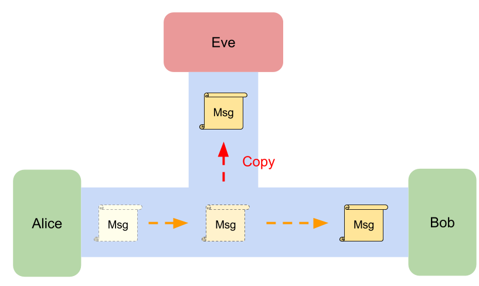
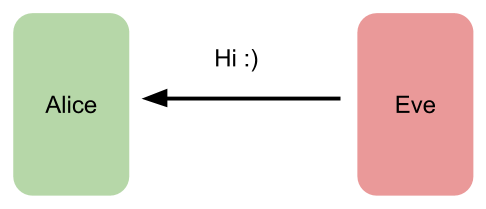

# Security requirements for PAKE

Any _PAKE_ protocol should meet the following requirements:

- __Off-line dictionary attack resistance__:
It does NOT leak any information for passive/active attackers
to allow them to perform offline-exhaustive search to find the private secrets.
- __On-line dictionary attack resistance__:
It gives an active attacker only one chance to test
the private secret per protocol.
- __Forward secrecy__:
It keeps the session key secure
even the private secrets is leaked later.
- __Known-session security__:
If one session key is leaked,
it does NOT affect to other established session keys.

We will introduce them in following contents.
Nevertheless, before reading them,
we should first have some basic ideas about
what is the passive attacker and active attacker.

## Passive Attacker and Active Attacker

We get started from picking up some knowledge of the attackers

### Passive Attacker: Eve, a eavesdropper

Suppose Eve is a passive attacker
for the communication between Alice and Bob,
then she can __see all messages on the channel__
but she __can't modify them__.

There are so many potential passive attackers in the real world network,
for example, The Internet provider, the government, WiFi sniffer,
Someone else on the same network as you.

If your don't encrypt your messages on networks,
it's easy to know what youtube you are watching,
your bank accounts, your credit card numbers,
or other personal information.

### Active Attacker: Eve

The active attacker will talk to your system directly.
If Eve is active attacker, then she will interact with Alice or Bob directly.
She will try to build a protocol with Alice by pretending to be Bob
to gain access or to gain greater privileges than she is authorized for.
She might randomly guessing the passphrase that Alice use to authenticate Bob.

To prevent from this, we usually limit the number to attempts
for authentication or building connection
(e.g., You have only three attempts to login to your accounts).

To get more detail, please see [types of attacks on WiKi][attack_type].

#### Active attacker in PAKE

The active attacker in _PAKE_ means that
she is able to directly engage in key exchange.

## Off-line Dictionary Attack Resistance

No matter the attacker is active or passive,
the communication between parties must NOT leak any data
that allows attackers to learn the private secret
by performing offline-exhaustive search.

For example, hash value might leak some information about the private data.
If the attacker know what hash function you used, then he can list all of
the pairs to crack your private data by searching the matched hash value
(Given hash value: 'ujm', then the private data 'n' can be found).

| private data     | hash value |
| ---------------- | ---------- |
| 0                | qaz        |
| 1                | wsx        |
| ....             | ...        |
| n                | ujm        |
| .....            | .......    |

## On-line Dictionary Attack Resistance

If the attacker directly start sending a key exchange request,
there is no way to prevent that
the attacker tries a guess of the private secrets.
However, the attacker should have only one try per communication,
and the successive failed attempts should be easily detected
and then blocked.

## Forward Secrecy

After running _PAKE_ protocol,
the engaging parties will have a shared secret key.
However, no one can guarantee that this shared secret won't be disclosed.
The past session keys must be protected
when the the shared secret is later leaked.

## Known-session Security

If an attacker can compromise a session,
then all the session-specific secrets may be leaked.
Nevertheless, the impact should be minimized.
The security of other established sessions must NOT be affected
by the compromised session.

[attack_type]: https://en.wikipedia.org/wiki/Attack_(computing)#Types_of_attacks "Types of attacks"
