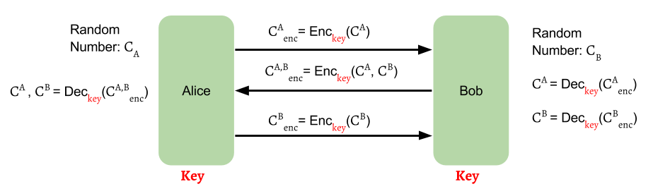
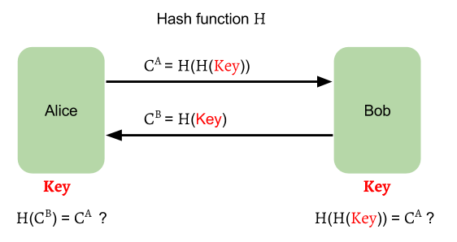

# General Two-Stage Framework

_PAKE_ has a general two-stage framework:

- Key Establishment Protocol
- Key Confirmation Protocol

## Key Establishment Protocol

In first stage, the engaging parties will negotiate to produce a session key
for their communication. One most common method is
[Diffie-Hellman Key Exchange][dh],
like the first stage of [_DH-EKE_][dh-eke] and [_SPEKE_][speke].

## Key Confirmation Protocol

In second stage, the engaging parties will authenticate each other.

### Challenge–Response Authentication

### Hash-Key Authentication

[dh]: ../appendix/dh/dh.md "Diffie-Hellman Key Exchange"
[dh-eke]: balanced/dh-eke.md "DH-EKE"
[speke]: balanced/speke.md "SPEKE"
