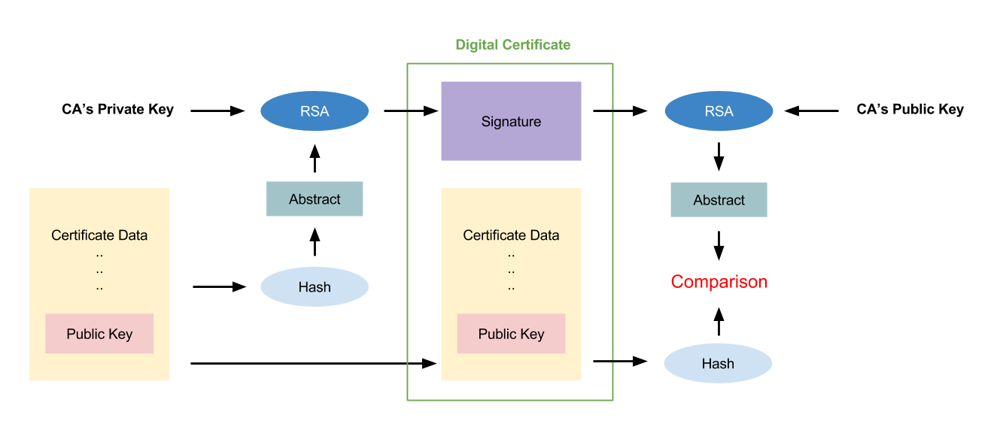

# Certificate Authentication

## Certificate

## Certificate Authority

## Certificate Authentication

The attackers is impossible to substitute the public key for their own one
because the public key will be encrypted by the CA's private key.
If the attackers replace the public key with their own one,
then the hash value of the _Certificate_ will be different from
the decrypted _Signature_.
Thus, the certificate can be a valid proof for authenticating the identification
unless the private key paired with the public key is leaked out.

## References

- [SSL Certificates HOWTO][ssl_how_to]

[ssl_how_to]: http://www.tldp.org/HOWTO/SSL-Certificates-HOWTO/x64.html "SSL Certificates HOWTO"
