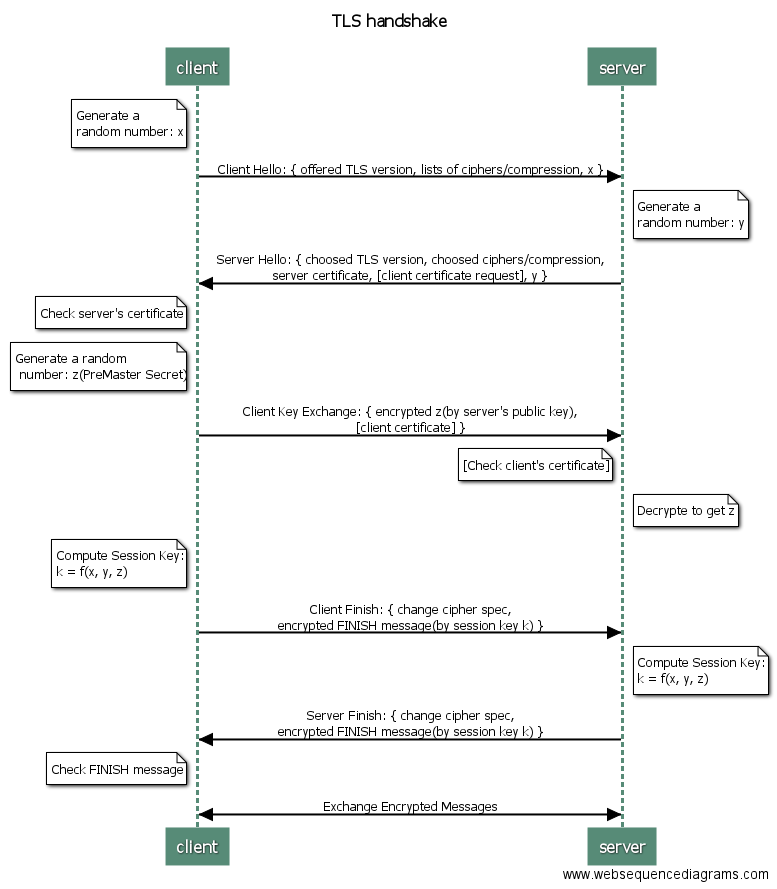
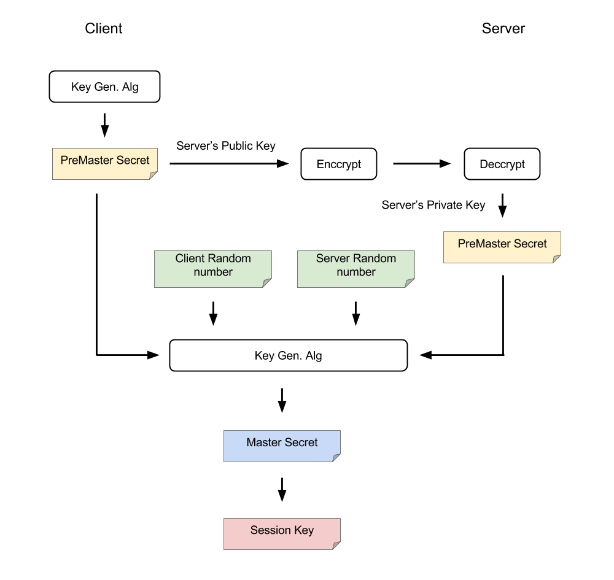

# Handshake

Diagram is generated by [WebSequenceDiagrams.com][web-seq-diagram]

## Client Hello

The client and the server support several versions of TLS.
To make sure they have a matched version to communicate,
the client first will send its list of supported TLS versions.

In the same manner,
the client and the server support many ciphers and compression and etc.,
some might be same, some might be different.
To make sure they can use the same methods on both side,
the client need to send its lists of supported ciphers/compression/etc.
to the server.

In addition, the client will generate a random number __x__.
It will be further used to generate the session key.

In summary, the client will send

- supported TLS versions
- supported ciphers
- supported compression
- supported ...
- a random number __x__

## Server Hello(with Server Done)

After receiving the _Client Hello_, server will reply
messages from _Server Hello_ to _Server Done_.
Some might sends each message respectively,
while the other might send just one message
including _Server Hello_ and _Server Done_.
The _Server Hello_ and _Server Done_ packet contains only head without content.

The server will search its TLS versions, ciphers, comparison, etc.
and choose the protocols matched with the client.
If there is no matched protocols of them, then the communication will be dropped.
Otherwise, the server will reply the matched protocols to the client.
The replied messages also include server's certificate,
which is a proof for server's identification.
The certificate is given by a __Certificate Authority__.
It will provide certificates to applied parties if they pass strict examines.

The server side will also pick a random number __y__
as an input for generating the session key.

The server can decide whether or not it needs the client's certificate
to prove the identification.
Some applications with higher security requirements may need to ask.

In summary, the server will reply

- chosen TLS version
- chosen ciphers
- chosen compression
- chosen ...
- server's certificate
- a random number __y__
- [ask for client's certificate]

## Client Key Exchange

The client needs to verify the server's certificate to check its identification.
If the certificate is invalid, then the client will show a alert
and let user decides whether the communication should be continued.

Next, the client will generate the third random number __z__
in this communication.
Similarly, the __z__ is also used to produce the final session key.
In this time, the __z__ is encrypted by the server's public key
before sending out.
The server's public key can be obtained from the server's certificate.

If the server asks the client's certificate,
then the client needs to add its certificate into the replied message.

In summary, the client will reply

- encrypted random number __z__
- [client's certificate]

## Client Finish

From the server's reply, the client can know which TLS version, ciphers,
and other matched methods they will use.
Thus, the client will add a _Change Cipher Spec_ message
to notify the server that the following communication will use the chosen
cipher to encrypt/decrypt the raw data based on their matched TLS version.

After adding _Change Cipher Spec_ message, the client will
encrypt a _FINISH_ message by the session key and send it to the server.
The session key is produced by the random numbers __x, y, z__.

In summary, the client will send

- _Change Cipher Spec_ message
- FINISH

## Server Finish

On server side, if it requires the client's certificate,
it will verify it upon receiving it.

The same session key can also be derived
from the random numbers __x, y, z__,
where the __z__ can be obtained
by decrypting the client's _Client Key Exchange_ messages by its private key.

After computing the session key, the server will also
use a _Change Cipher Spec_ message to notify the client
that the following messages will be encrypted.
By the same token, the message will be sent
with an encrypted _FINISH_ message by using the derived session key.

In summary, the server will send

- _Change Cipher Spec_ message
- FINISH

## Authentication

If the both sides can decrypt the FINISH message based on the previous
handshake messages, then it means that the valid channel
is established successfully.
They can use the session key in the following communication.

## Secret Keys

### Why does TLS need to generate a session key? Can it use the public key directly?

The symmetric encryption is faster than the asymmetric one.
TLS protocol allows the engaging parties to negotiate a symmetric key
to boost the encryption instead of directly using
asymmetric public-private key pair.

## References

- [SSL/TLS原理详解][ssl_description]
- [SSL/TLS协议运行机制的概述][tls_feng]

[ssl_description]: https://segmentfault.com/a/1190000002554673 "SSL/TLS原理详解"
[tls_feng]: http://www.ruanyifeng.com/blog/2014/02/ssl_tls.html "SSL/TLS协议运行机制的概述"
[web-seq-diagram]: https://goo.gl/BTLkqf "WebSequenceDiagrams.com"
[ca]: cert_auth.md "Certificate Authentication"
